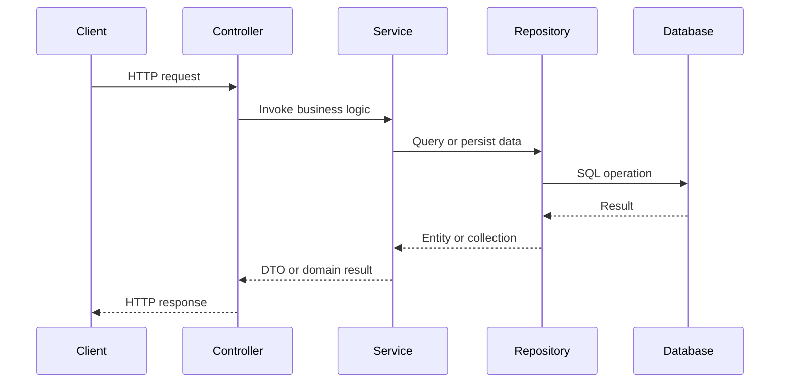
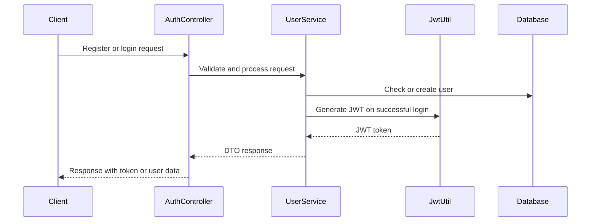

# Architecture Overview

This document describes the current architectural direction of the Glam & Glow backend and the evolution planned for future development.

## High-Level Architecture

The project follows a layered Spring Boot architecture with clear separation between:

- Controllers for HTTP handling
- Services for business logic
- Repositories for persistence
- Entities for persistence models
- DTOs for API contracts
- Security components for authentication and authorization

## Current Package Responsibilities

| Package | Responsibility |
| --- | --- |
| config | Security and application configuration |
| controller | REST endpoints |
| dto | Request and response DTOs |
| entity | JPA entities |
| exception | Domain and validation exception handling |
| repository | Persistence access |
| security | JWT generation and request authentication |
| service | Business logic |

## Layer Responsibilities

### Presentation Layer
Responsible for receiving HTTP requests and returning appropriate responses.

Current state:
- Authentication endpoints exist
- User endpoints exist

### Application Layer
Responsible for business rules and orchestration.

Current state:
- User registration and login logic are handled in the service layer

### Persistence Layer
Responsible for database access and persistence operations.

Current state:
- Spring Data JPA repositories manage user persistence
- Category persistence components are now introduced with a repository, DTOs, and mapper
- A category service layer now handles domain validation, duplicate checks, lookups, updates, deletion, and pagination-ready list handling

### Security Layer
Responsible for authentication, authorization, and protecting endpoints.

Current state:
- JWT-based authentication is configured
- Security filters are applied before request processing

## Request Lifecycle

## Authentication Flow

## Current Security Architecture

Current implementation includes:

- Password hashing using BCrypt
- JWT-based authentication
- Stateless session management
- A filter chain for request authentication
- Public access for authentication and Swagger endpoints
- Protected access for the rest of the API

## Planned Architecture

The architecture will evolve to support:

- Dedicated mapper layer for DTO/entity conversion
- More structured domain modules for catalog, cart, order, and payments
- Clearer package organization for auth, user, common, and domain-specific DTOs
- More explicit exception handling for domain-specific failures
- Structured logging and monitoring support

## Design Principles

- Keep controllers thin
- Keep business logic in services
- Avoid exposing entities directly through APIs
- Prefer DTOs for external contracts
- Use constructor-based dependency injection
- Keep modules focused and maintainable
- Design for future extension and team collaboration

## Future Architecture Improvements

TODO:
- Introduce a mapper package and mapstruct-based transformations if needed
- Add a shared response envelope for all endpoints
- Standardize pagination and filtering patterns across modules
- Add observability and tracing support
- Introduce a more formal module structure for future domain growth
