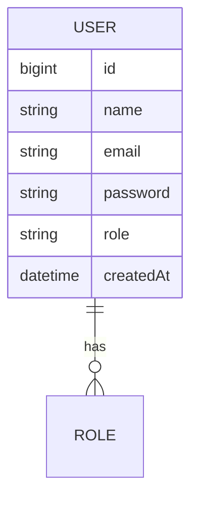
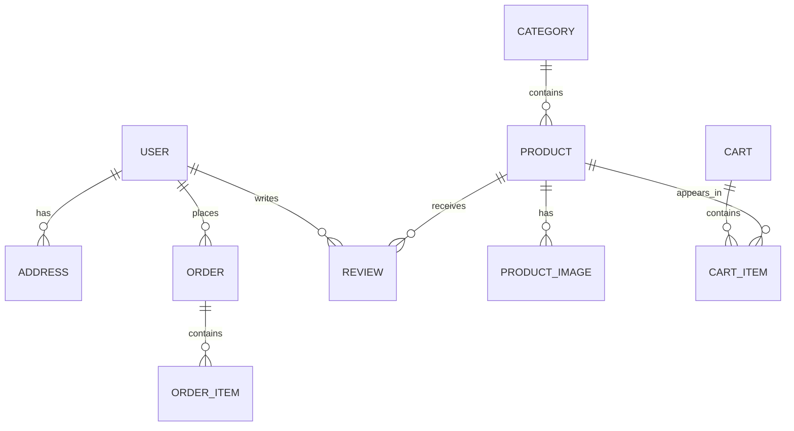

# Database Design

This document captures the current database direction for Glam & Glow and highlights the planned evolution of the schema.

## Current State

The current project uses PostgreSQL with Spring Data JPA and Hibernate.

At the present stage, the main persisted entity is the user model.

## Current Entities

### User
Represents a registered application user.

Current fields include:
- id
- name
- email
- password
- role
- createdAt

### Role
An enum-based role definition for the user domain.

## Current Relationships

At this stage, the persistence model is intentionally simple.

Current relationships:
- User -> Role (enum-based assignment)

No additional entity relationships have been introduced yet.

## Current Database Schema

The current schema is managed by Hibernate with `ddl-auto=update`.

The main table in use is:
- users

## Planned Future Tables

The following tables are expected in later phases:

- addresses
- categories
- products
- product_images
- wishlists
- carts
- cart_items
- coupons
- orders
- order_items
- payments
- reviews
- forum_posts
- forum_comments

## Indexes

TODO:
- Add an index on `users.email`
- Add indexes on frequently queried catalog fields such as category, price, and status
- Add indexes on order lookup fields such as user_id and status

## Foreign Keys

TODO:
- Define foreign keys for user-related child entities
- Define product-to-category relationships
- Define cart/order/payment relationships

## Cascade Strategies

TODO:
- Define delete behavior for child entities under users, orders, and carts
- Decide whether orphan removal should be used for address and wishlist data

## Fetch Strategies

TODO:
- Review eager vs lazy loading behavior for product and order relationships
- Avoid N+1 query issues in catalog and order flows

## Normalization Decisions

Current state:
- The user model is normalized enough for the current phase

Future considerations:
- Separate address information into its own table
- Normalize product metadata and image references
- Normalize review and forum content into dedicated tables

## Entity Relationship Diagram (Current)

## Entity Relationship Diagram (Planned)

## Notes

This document should be updated whenever new entities, relationships, or persistence strategies are introduced.
